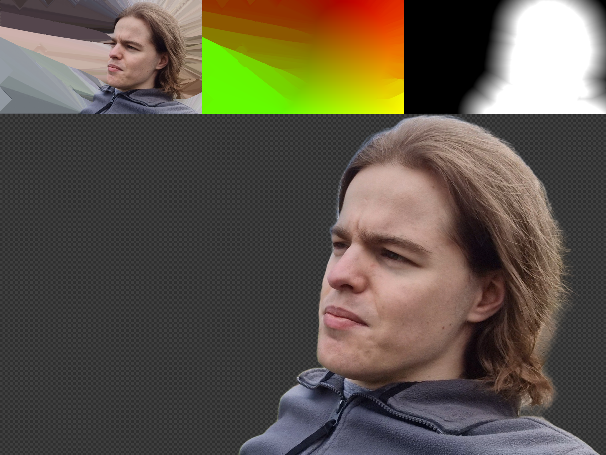

# pixelquix
It's like pixelfix, but quix.

- Written in Rust for low-level speed
- Uses `rayon` for work-stealing parallelism
- Based on Jump Flood for impressive speed even up to 8K
- Configurable alpha threshold to deal with blurry edges
- Configurable edge mode for dealing with clamped and repeating textures
- Outputs a variety of formats, including distance fields, opaque colour, and UV

## License

Licensed the same way as all of my open source projects: BSD 3-Clause + Security Disclaimer.

As with all other projects, you accept responsibility for choosing and using this project.

See [LICENSE.md](./LICENSE.md) or [the license summary](https://github.com/dphfox/licence) for details.
